# Repositório TI24

## Como clonar através do GIT
1. Baixe e instale o [GIT](https://git-scm.com/)
2. Configure através do CMD o usuario e o e-mail
    ```git
    git config --global user.email "seu@email.com"
    git config --global user.name "seu nome"
    ```
3. Copie o link do repositório requerido
    ```git
    https://github.com/paulowh/TI24.git
    ```
4. Clone o repositório pelo CMD
    ```git
    git clone link-repositório
    ```
5. Altere a branch para a UC que desejar
    ```git
    git checkout {nome-da-branch}
    ```
6. Após a clonagem abra o repositório no [VsCode](https://code.visualstudio.com/)

***

## Extensões VSCode
> Bom dia, boa tarde e boa noite, vocês sabem que eu não sou muito fã de extensões no VsCode mas tenho que admitir que tem algumas que nos ajuda bastante no dia a dia, aqui eu separei as extensões que eu achei mais interessante para usar nessa ferramenta maravilhosa

### Geral

As melhore para o uso geral da ferramenta

- Brazilian Portuguese - Code Spell Checker 
    > Essa extensão vai verificara sua ortografia nos códigos, ele vai validar se você esta escrevendo corretamente!!! 
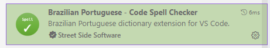

- Error Leans
    > Essa extensão vai nos facilitar um pouco a vida, ele mostra o erro do código em na própria linha
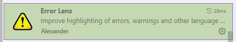

- JetBrains Icon Theme
    > Essa extensão vai dar uma cara mais bonita para as suas pastas, no mercado existe outras até mais popular como o `material icons`, mas particularmente prefiro essa.
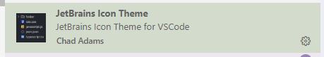

    | Antes do JetBrains Icon Theme | Depois do JetBrains Icon Theme |
    |---------|--------|
    | 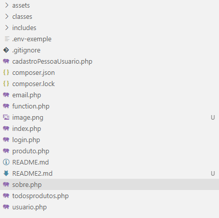 | 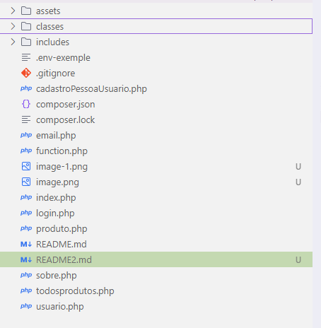 |

- Rainbow Brackets & Toggle Bracket Guides & indent-rainbow
    > Agora temos um combo de extensões, o Rainbow Brackets muda as cores do Brackets `parentes(), colchetes[] e chaves{}`, o Toggle Bracket Guides cria uma guia entre a abertura e o fechamento seguindo as mesmas cores do brackets atual e  o indent-rainbow mostra para visualmente a sua indentação.
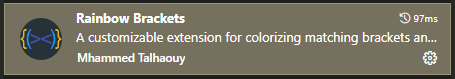
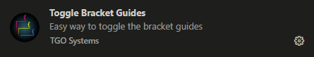
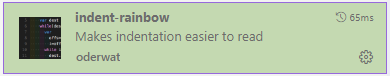
    
    > ***ps.*** essa combinação fica boa apenas no tema escuro devido as cores padrões
    
### HTML/CSS/JS

Aqui vou listar as que eu uso para o nosso querido front-end

- HTML CSS Support
    > Vamos começar com o clássico, o nosso dia a dia vamos repetir muitas TAGS essa extensão vai nos ajudar no auto complete, ele vai ter um suporte amplo tanto no HTML quanto no CSS 


- CSS Snippets
    > Com o tempo nosso projeto vai começar a crescer e com essa extensão vamos conseguir gerir melhor nossas classes em arquivos diversos. 
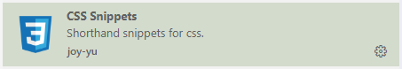

- Color Highlight
    > Acho que a mais simples dessa lista, uma extensão que nos ajuda a ver a cor do nosso HEX e RGB


- JavasScript (ES6) code Snippets
    > Essa extensão vai nos ajudar com alguns comandos já configurados ele é ótimo para criar as estruturas base dos nossos blocos de códigos
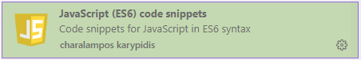

- Bootstrap IntelliSense
    > Aqui já vou colocar um queridinho, ele nos ajuda a escrever as classes já existente no framework do bootstrap
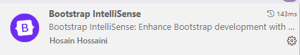

### PHP

Vamos listar as melhores para o nosso querido back-end

- PHP Intelephense
    > Esse cara igual ao bootstrap nos ajuda com as variáveis e com algumas estruturas já gravada, ele é ótimo para criar blocos de códigos
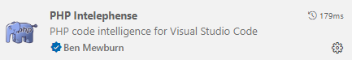

- MySQL
    > Tomem cuidado com esse pois o nome dele é simples, verifiquem sempre o criador da extensão para confirmar, esse cara aqui ele nos ajuda a consultar coisas de bancos de dados sem precisar sair da ferramenta.
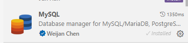

## [Wiki TI24](https://github.com/paulowh/TI24/wiki)

### Como contribuir com a Wiki

Em breve...
